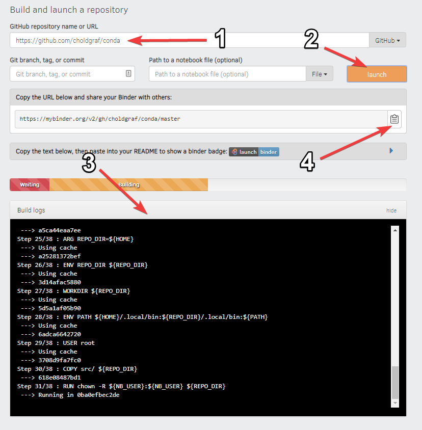

.. _introduction:

===========================
Getting started with Binder
===========================

What is the Binder Project?
===========================

The Binder Project is an open community that makes it possible to create sharable,
interactive, reproducible environments. The main technical product that
the community creates is called BinderHub, and one deployment of a BinderHub
exists at ``mybinder.org``. This website is run by the Binder Project as
a public service to make it easy for others to share their work.

.. _what-is-a-binder:

What is a Binder?
=================

A Binder (also called a Binder-ready repository) is a code repository that
contains at least two things:

1. **Code or content that you'd like people to run.** This might be a
   Jupyter Notebook that explains an idea, or an R script that makes a
   visualization.
2. **Configuration files for your environment.** These files are used
   by Binder to build the environment needed to run your code.
   For a list of all configuration files available, see the
   :ref:`config-files` page.

Configuration files may be placed in the root of
your repository or in a ``binder/`` folder in the repository's root
(i.e. ``myproject/binder/``).

A Binder repository can be built by a BinderHub, which will generate a
link that you can share with others, allowing them to interact with the
content in your repository.

.. _preparing_repositories:

Preparing a repository for Binder
=================================

In order to prepare your repository for use with the BinderHub
at mybinder.org, all you
need to do is ensure that the following conditions are met:

* The repository is in a public location online (e.g., on GitHub or BitBucket)
* The repository does not require any personal or sensitive information
  (such as passwords)
* The repository has configuration files that specify its environment
  (see below for an example)
* The repository contains content designed for people to read.

.. tip::

   For a list of sample repositories for use with Binder, see the
   `Sample Binder Repositories <sample_repos.html>`_ page.

A Binder example
================

For example, let's take a look at a simple repository that requires a
few packages in order to run.

Explore the repository contents
-------------------------------

If we inspect the contents of this repository,
we see the following files:

.. code-block:: bash

   ./
   ├── environment.yml
   ├── index.ipynb
   └── README.md

In this case, we have two important files:

* **A content file**: ``index.ipynb`` is a short Jupyter Notebook that
  generates a plot.
* **An environment configuration file**: ``environment.yml`` is a standard
  file that specifies an Anaconda environment.

.. important::

   You may notice that ``environment.yml`` is not Binder-specific. This is
   intentional! Binder tries to use environment configuration files that are
   already standards in the data science community. For a list of all
   configuration files available, see the :ref:`config-files` page.

Get your own copy of this repository
------------------------------------

You can find a repository with these files at the following link:

https://github.com/binder-examples/conda

To watch Binder in action, first **fork this repository**. This will
give you your own copy of the ``conda`` repository.

Build your repository
---------------------

Next, let's **build your Binder repository**. Head to https://mybinder.org.
You'll see a form that asks you to specify a repository for mybinder.org to
build. In the first field, paste the URL of your forked repository. It'll look
something like this:

.. code-block:: none

   https://github.com/<your-username>/conda

Finally, click the **launch** button. This will ask mybinder.org to
build the environment needed to run the repository. You can click on the
"Build logs" button to see the logs generated by the build process.

While your Binder is building, note the URL that points to your unique Binder.
You can share this URL with a friend, allowing them to access an interactive
version of your repository.

See below for a quick layout of the BinderHub user interface.

If your Binder has already been built once, then subsequent clicks on
the Binder link will not re-trigger the build process. However, if you
push any changes to the repository, then it will be re-built the next time
somebody clicks a link.

Now that you're acquainted with Binder, see the :ref:`using-binder` page
for more information about what you can do with it.
